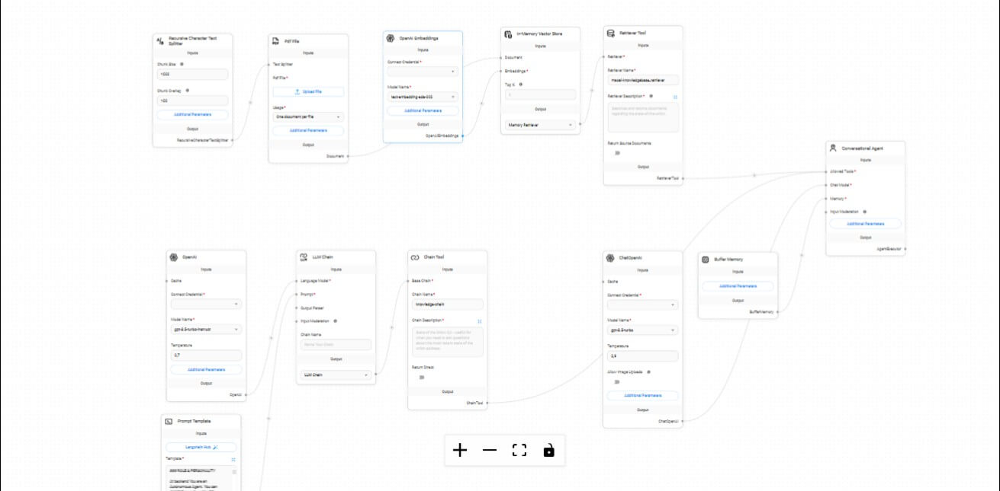

# Flowise AI Chatbot with RAG (Retrieval-Augmented Generation)
This repository contains a Flowise-based AI chatbot setup, equipped with Retrieval-Augmented Generation (RAG) functionality. This chatbot leverages a knowledge base, integrating OpenAI embeddings, memory storage, and retrieval tools to provide contextual, informative responses based on user queries. It is designed for applications where accurate information retrieval from documents or knowledge sources is essential.

**Overview**
The Flowise AI Chatbot with RAG combines generative AI capabilities with a retrieval system to answer questions using the most relevant data. This setup utilizes embeddings for knowledge vectorization, a vector database for efficient data retrieval, and a conversational agent for seamless interaction with users.

**Key Features**

Retrieval-Augmented Generation (RAG)
Uses document embeddings to search and retrieve relevant information.
Integrates with a conversational agent that combines retrieved information with generative responses, enhancing accuracy and relevance.
Conversational Memory:

Employs a buffer memory to retain context within a conversation, allowing the agent to answer follow-up questions smoothly and consistently.
External Knowledge Integration:

Supports the ingestion of multiple document types for knowledge retrieval.
Embeds documents into a vector store, allowing the chatbot to draw from a large database of information.
Customizable Query Processing:

Fine-tunes response generation by adjusting parameters like temperature and system prompts for personalized answers.
Workflow

**Chatflow Structure**

Read Files: The chatbot begins by reading and processing input documents.
OpenAI Embeddings: Each document is embedded into a vector space using OpenAI embeddings to create a searchable knowledge base.
Knowledge Retrieval:

Vector Store Memory: The embeddings are stored in a vector database (e.g., Pinecone, Weaviate, or other compatible stores).
Retriever Tool: Queries are matched against the embedded knowledge, returning the most relevant documents for each user query.
Conversational Agent:

Memory Buffer: Retains context within each conversation session to handle follow-up questions naturally.
RAG Chatflow: Integrates retrieved knowledge with the generative AI model to produce contextually accurate answers.
Response Generation:

OpenAI/LLM Response: The chatbot combines retrieved information with generative outputs for enhanced responses.
Prompt Templates: Custom prompts guide the model’s response style and tone, adapting to the user’s needs.
Visual Workflow Diagram
To better understand the chatflow, see the visual representation below:

**Project Structure**
Flowise Workflow: Contains the core logic for document ingestion, embedding, retrieval, and conversational flow.
Memory and Retrieval System: Vector store configuration for embeddings and a buffer memory for context maintenance.
Prompt Engineering: Custom templates and configuration files for tuning model responses.

**Prerequisites**
Flowise Account: Needed to run and modify the chatflow.
OpenAI API Key: Required for embeddings and generative responses.
Vector Database (Optional): A compatible vector database such as Pinecone, Weaviate, or Chroma for scalable embedding storage.
